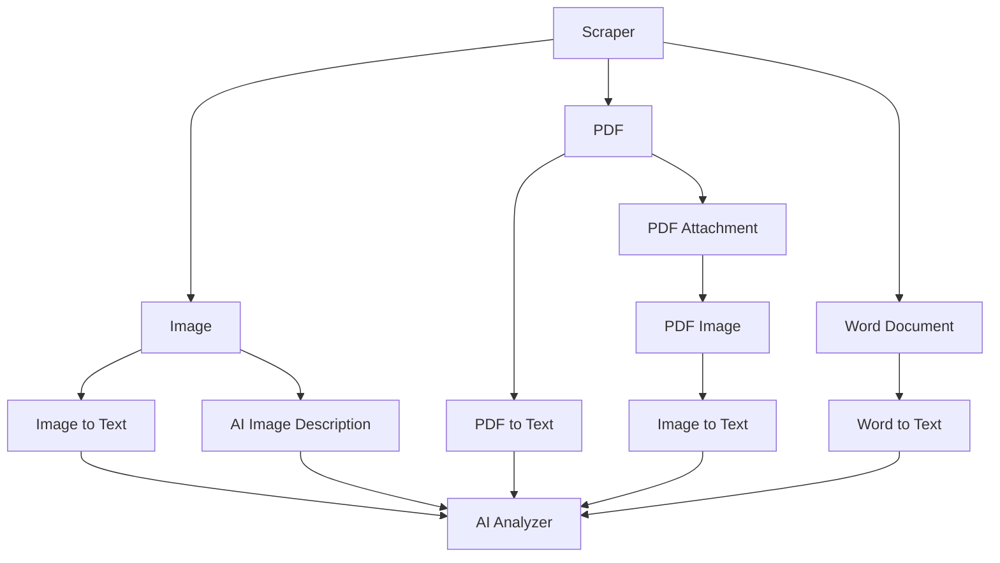
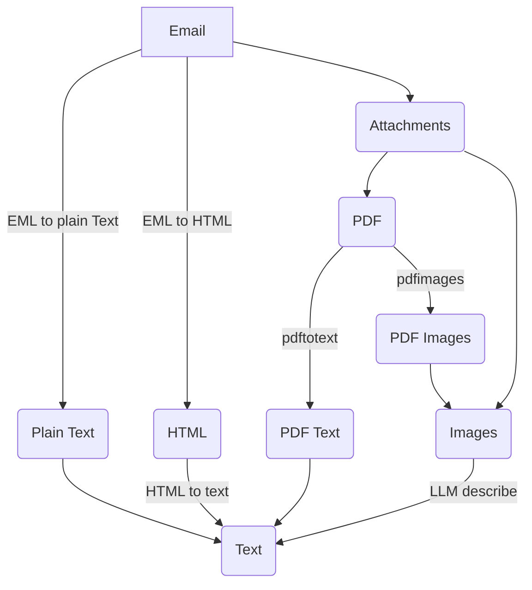

# Offpost

Offpost - Offentlig post - er en tjeneste for å sende e-post til offentlige myndigheter.

Tjenesten baserer seg på at man lager en forespørsel til en myndighet. Denne får en unik profil med tilfeldig navn og epost. Eposten brukes for å sende e-post og å motta svar. De tilfeldige navnene baserer seg på Motorvognregisteret, så det er ekte navn men kombinasjonen av fornavn og etternavn er sannsnyligvis unik siden navene ikke er vektet.

Offpost was internally known as "email-engine". From 06.12.2024, this project have been written by AI tools.

## Architecture
(kept in sync with .clinerules in the root directory)

Offpost is mainly a PHP application running on a web server. It revolves around email threads sent to public entities.

One email thread is a conversation between the system and a public entity. Or mulitple in case of a complaint.
Connected to the thread is a profile of first name, last name and email address. This is unique for each thread.

It uses IMAP to get emails from a mail server and store them in local storage. The emails are sorted into threads
based on the to/from addresses that matches the profile of the thread.

## Components
(kept in sync with .clinerules in the root directory)

### Organizer
- Main program that provides client, API and JSON storage for email threads
- Creates threads and "identities" in Roundcube
- Sorts email using IMAP folders directly on the server

### Roundcube
- Webmail client using the IMAP server directly
- Email threads are stored as folders on the IMAP server
- Uses MySQL for storage

### Sendgrid (Production only)
- Used to send emails
- Handles copying to the IMAP server

### IMAP Server
- Used to store email threads
- Email threads are organized as folders on the server

### Auth Service (Development only)
- Simple authentication service for development
- Not intended for production use

### GreenMail (Development only)
- SMTP/IMAP server for development environment
- Provides email testing capabilities without external dependencies
- Configured with test accounts for local development

## Development

### Setup

1. Start the development services:
```bash
docker-compose -f docker-compose.dev.yaml up -d
```

2. Access Roundcube (mail client):
- URL: http://localhost:25080/

3. For new database setup:
- Create Roundcube identities: http://localhost:25081/update-identities.php
- Update IMAP and sort folders: http://localhost:25081/update-imap.php

### Production

See [infrastructure/production/README.md](infrastructure/production/README.md) for details.

For production deployment:
```bash
docker-compose -f docker-compose.prod.yaml up -d
```

Note: The auth service is only available in development. For production uses auth0.

### Running Tests

To run the organizer tests:
```bash
cd organizer/src && ./vendor/bin/phpunit tests/
```

### Available Services

- Organizer (PHP Client): http://localhost:25081/
- PHPMyAdmin: http://localhost:25082/ (Development only)
- Adminer: http://localhost:25084/ (Development only - supports both PostgreSQL and MySQL)
- Test Tools: http://localhost:25081/send-test-mail.php

### Starting a New Email Thread

1. Generate a profile:
```bash
php generate-profile.php
```

2. Use the generated link (example):
```
http://localhost:25081/start-thread.php?my_email=asmund.visnes%40offpost.no&my_name=%C3%85smund+Visnes
```

3. Create thread:
   - Set title and label
   - Connect to Entity

4. Sync with Roundcube:
   - Update identities: http://localhost:25081/update-identities.php
   - Open Roundcube: http://localhost:25080/
   - Send email from the identity

5. Post-send steps:
   - Sync to repo: http://localhost:25081/update-imap.php
   - Update thread details:
     - Set sent = true
     - Update status_type and status_text

### Document Flow Processing

The diagram below illustrates how the scraper processes different document types through various stages to the AI analyzer. This shows the complete flow from document ingestion to analysis.



### Extracting information from emails

From an email there are multiple ways to extract text. The diagram below shows the different paths for text extraction from emails, including plain text conversion, HTML parsing, and handling of attachments like PDFs and images.


